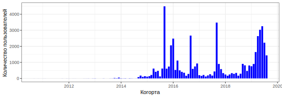

= Российские и зарубежные пользователи сервиса
:toc:
:toclevels: 3
:toc-title: Содержание
:src: sql
:icons: font

== Как отличить отечественного пользователя от зарубежного?

Пользователь оставляет три кусочка информации, которые можно привязать к стране:

 - Адрес
 - Телефон
 - IP адрес

Беда в том, что мало у кого заполнены адреса, с телефонами ситуация несколько лучше,
и самая полная (хоть и не 100% полная) информация есть по IP адресам последнего входа.
Будем считать россиянами тех пользователей, у которых хотя бы один из этих признаков
указывает на Россию.

Конечная задача этого этапа -- построить список User ID-ов, которые считаются российскими.

=== Классификация адресов

[source,sql]
----
include::{src}/01_create_rus_with_address.sql[]
----

Проверяю, что табличка создалась:

[listing]
----
dgolub=> select * from c10_users_with_addresses limit 2;
   uid   |   city    |               region               | country 
---------+-----------+------------------------------------+---------
  119414 | Lyantor   | Khanty-Mansiyskiy Avtonomnyy Okrug | Russia
  164276 | Serpukhov | MO                                 | Russia

dgolub=> select * from c10_users_with_addresses where country <> 'Russia' limit 2;
   uid   |  city   |   region    | country 
---------+---------+-------------+---------
  170065 | Hadgāon | Maharashtra | India
  168259 | Narón   | Galicia     | Spain
----

Ок, эта часть классификатора готова.

=== Классификация телефонов

Диапазоны для росийских телефонов взяты https://jasmi.ru/telefonnye-kody-stran-mira[из Сети],
эти данные согласуются и с
https://ru.wikipedia.org/wiki/%D0%A2%D0%B5%D0%BB%D0%B5%D1%84%D0%BE%D0%BD%D0%BD%D1%8B%D0%B5_%D0%BA%D0%BE%D0%B4%D1%8B_%D1%81%D1%82%D1%80%D0%B0%D0%BD#%D0%97%D0%BE%D0%BD%D0%B0_7[Википедией].

[source,sql]
----
include::{src}/02_create_rus_with_phone.sql[]
----

Проверяю:

-----------
dgolub=> select * from c10_users_with_phone limit 3;
  uid    |    phone    | country 
---------+-------------+---------
 1886022 | 79645822598 | Russia
 2019421 | 79625379259 | Russia
 1987320 | 79068740262 | Russia

dgolub=> select * from c10_users_with_phone where country <> 'Russia' limit 3;
  uid    |    phone     | country 
---------+--------------+---------
 2370045 | 375297000000 | Foreign
 2185526 | 375297000000 | Foreign
 2382362 |   9513245729 | Foreign
-----------

Вроде бы всё благополучно.  Хотя есть странность: пользователи 2370045 и 2185526 разделяют один
номер телефона.  А ещё есть такие пользователи?

 dgolub=> select count(phone) - count(distinct phone) as shared_phones from c10_users_with_phone;
 shared_phones 
 ---------------
      544

Оказываается, таких пользователей много.  Можно ещё поинтересоваться, откуда они:

....
 dgolub=> select phone, count(uid) as uids from c10_users_with_phone group by phone having count(uid) > 1  order by uids desc;
    phone     | uids 
 --------------+------
 375292000000 |   18
 380714000000 |   18
 375445000000 |   16
 375299000000 |   16
 375333000000 |   16
 375297000000 |   16
 375291000000 |   14
     ...
 998944000000 |    2
 380688000000 |    2
(159 rows)
....

По всей видимости, эти аномалии в данных из-за того, что данные сгенерированные, а не реальные. Большая часть номеров принадлежит
странам бывшего СССР, т.е. Украине, Белоруссии, Азербайджану, ...

=== Определение страны последнего входа по IP адресу

Мне предстоит много запросов в большую таблицу диапазонов IP адресов,
поэтому хорошей идеей будет её индексирование по IP:

[source,sql]
----
include::{src}/03_index_ip2loc_table.sql[]
----

Напоминаю, что я работаю с локальной базой и могу создавать в ней объекты без
особых проблем.

[source,sql]
----
include::{src}/04_create_rus_with_geoip.sql[]
----
<1> Это CTE создаёт виртуальную таблицу "User ID | IP октетами | IP числом"
<2> Преобразование адреса из октетов в BigInt
<3> Поиск адресов в диапазоне.

Табличка создаётся долго (на моей базе, которая работает в контейнере и ограничена  по
ресурсам -- 7 минут).

Результат -- страны определены для 49914 пользователей из 50 тыс.

Проверяю, что получилось:

[listing]
....
dgolub=> select * from c10_users_with_geoip limit 3;
   uid   |    ip_addr     |  int_addr  |  ip_from   |   ip_to    |    country_name    
---------+----------------+------------+------------+------------+--------------------
 1886022 | 89.169.72.78   | 1504266318 | 1504247808 | 1504313343 | Russian Federation
 2403464 | 37.98.248.114  |  627243122 |  627240960 |  627245055 | Russian Federation
  367821 | 128.73.199.169 | 2152318889 | 2151940096 | 2152464383 | Russian Federation

dgolub=> select * from c10_users_with_geoip where country_name <> 'Russian Federation' limit 3;
   uid   |    ip_addr     |  int_addr  |  ip_from   |   ip_to    |    country_name    
---------+----------------+------------+------------+------------+--------------------
 2283296 | 116.36.201.154 | 1948567962 | 1948254208 | 1949302783 | Korea, Republic of
 2318834 | 178.168.180.74 | 2997400650 | 2997387264 | 2997420031 | Belarus
 2370045 | 46.56.231.58   |  775481146 |  775421952 |  775487487 | Belarus
....

=== Создание общего списка российских UID-ов

Объединю для этого колонку UID всех трёх таблиц с адресами.

[source,sql]
----
include::{src}/05_union_russian_uids.sql[]
----

В этот список придётся обращаться часто, поэтому проиндексирую его.

[source,sql]
----
include::{src}/06_index_russian_uids.sql[]
----

Проверяю, что эта таблица работает:

[source,sql]
----
include::{src}/07_check_addresses_with_uids.sql[]
----

|===
|  user_id |          city           |           region            |        country         

|   170065 | Hadgāon                 | Maharashtra                 | India
|   168259 | Narón                   | Galicia                     | Spain
|   108773 | Riyadh                  | Ar Riyāḑ                    | Saudi Arabia
|    ... | ... | ... | ...
|  2474656 | Petatlán                | Guerrero                    | Mexico
|  2492617 | Kivertsi                | Volyn                       | Ukraine
|  2492871 | Chuhuyiv                | Kharkiv                     | Ukraine
|===

Аналогично проверяю с таблицей GeoIP:

[source, sql]
----
include::{src}/08_check_geoip_with_uids.sql[]
----

Итак, создан список пользователей из России. Обратный список (иностранцев) нет смысла
делать, одного списка тут достаточно.  Поиск идёт достаточно быстро (B-Tree).

== Когортный анализ российских пользователей

> Постройте когортный анализ по пользователям из России.
> В каком месяце была максимальная конверсия в оплату из зарегистрировавшихся в
> том же месяце? Учитывайте только месяцы, где было 100 и больше регистраций.

Собираем когорты по месяцам пока что для всех пользователей, за основу для когорт берём
поле `created_at` из таблицы `case10.users`.  Количество пользователей ещё понадобится,
поэтому сохраним во view `case10.users_count_by_cohort`.

[source, sql]
----
include::{src}/09_form_cohorts_common.sql[]
----

При выполнении этого запроса получаем таблицу количества зарегистрированных пользователей
по когортам. Построив график по этой таблице, получаем:

Разделим количество пользователей по когортам на российских и иностранных, для
этого используем `exists` и ранее созданную таблицу `c10_russian_users_ids`;

[source,sql]
----
include::{src}/10a_form_rus_foreign_cohorts.sql[]
----

[source,sql]
----
include::{src}/10b_form_rus_foreign_cohorts.sql[]
----

Далее понадобится таблица `carts`. Её размеры: 6 полей, 499989 строк. Судя по тому,
что пользователей на порядок меньше, на пользователя приходится в среднем несколько
транзакций. Проверяю:

[listing]
....
dgolub=> select state, round(count(distinct id)*1./count(distinct user_id),2) as apc
	 from case10.carts group by state;
   state    | apc  
------------+------
 canceled   | 1.23
 created    | 1.09
 pending    | 2.13
 successful | 1.74
....

> постройте когортный анализ по пользователям из России.

Для когортного анализа необходимо время жизни пользователя (lifetime).

Для начала построим на основе таблиц `case10.cart` и `case10.users` (виртуальную) таблицу такого формата:

|===
| user_id | cohort | purchased_at | lifetime
|===

Где `purchased_at` будет датой покупки для корзины, а lifetime разницей в месяцах между датой
покупки и датой регистрации.  В этот раз я не буду относить все покупки к дате первой покупки для
заданного клиента, а буду учитывать их в тех месяцах, когда они произошли.

!!! Позже это будет переделано - сделай ссылку

[source,sql]
----
include::{src}/11_lifetime_in_days.sql[]
----

Пример выдачи:

Но здесь получается разница в днях, а для анализа нам нужны месяцы. Думаем дальше.

Нужно как-то перевести временные промежутки (типа 'interval') в целые месяцы.

Нашёл в https://stackoverflow.com/questions/14251456/months-between-two-dates-function[треде на Stack Overflow]
решение с созданием пользовательских функций:

[source,sql]
----
include::{src}/12_months_between_function.sql[]
----

Теперь используем эти функции при расчёте лайфтайма.

Заполнение данных о когортах:

[source,sql]
----
include::{src}/13_compute_lifetime_cte.sql[]
----

В результате такого запроса получается:

.Когорты и покупки российских пользователей (обрезано)
|===
|   cohort   | lifetime |  uid   |      purchased_at       

| 2016-01-01 |        0 | 504197 | 2016-01-06 19:17:39.28
| 2015-09-01 |        2 | 247529 | 2015-11-09 16:53:09.951
| 2015-01-01 |       10 | 106958 | 2015-11-14 13:33:57.959
| ... | ... | ... | ...
|===

Далее этот запрос можно использовать как подзапрос с помощью CTE. Создавать представление нет
особого смысла, так как непосредственно результаты запроса использоваться не будут. 
Подсчитаем количество покупателей из России и иностранных:

[source,sql]
----
include::{src}/14_amount_of_russian_users_from_carts.sql[]
----

Аналогично для иностранцев `exists` в условии `where` меняется на `not exists`.  Листинг
приводить нет смысла, изменения слишком малы:

Запрос количества российских покупателей выдаёт *3146*, иностранных: *48*.

Подсчёт транзакций российских пользователей по когортам становится элементарным при 
использовании определённого выше CTE (лимит установлен для демонстрации работы запроса).

[source,sql]
----
include::{src}/15_russian_transactions_by_cohort_v1.sql[]
----

Результат:

.Суммирование покупателей и транзакций по когортам и времени жизни
|====
|   cohort   | lifetime | buyers | transactions 

| 2011-10-01 |       48 |      1 |            1
| 2011-10-01 |       54 |      1 |            2
| 2012-01-01 |       44 |      1 |            2
| 2012-08-01 |       50 |      1 |            1
| 2012-08-01 |       55 |      1 |            1
|====

Для подсчёта конверсии необходимо добавить в эту таблицу количество зарегистрированных пользователей
по когортам.  Используем определённые выше запросы в CTE.

[source,sql]
----
include::{src}/16_russian_buyers_and_transactions_by_cohort_v2.sql[]
----

.Пример результата:
[listing]
----
dgolub=> select * from ru_cohorts_transactions limit 3;
       cohort        | registered_users | lifetime | buyers | transactions 
---------------------+------------------+----------+--------+--------------
 2011-10-01 00:00:00 |                2 |       48 |      1 |            1
 2011-10-01 00:00:00 |                2 |       54 |      1 |            2
 2012-01-01 00:00:00 |                2 |       44 |      1 |            2
----

Суммируем покупателей из колонки `buyers`, получаем 5632, что явно больше, чем
суммарное количество покупателей в таблице `carts`.  Очевидно, какие-то покупатели
учитываются больше одного раза, так как они совершали покупки в разные недели.
Нужно преобразовать выдачу CTE 'transactions_by_cohort' так, чтобы покупатель в
 ней фигурировал один раз, при первой транзакции.
Количество транзакций можно не учитывать, оно в  анализе использоваться не будет.

[source,sql]
----
drop view ru_cohorts_transactions;
----

[[ru_cohorts_transactions]]
Переписал запрос таким образом:

[source,sql]
----
include::{src}/17_create_view_ru_cohorts_transactions.sql[]
----

<1> Добавляет к UID и времени покупки из корзины когорту и время жизни и фильтрует, 
оставляя только российских пользователей.

<2> Оставляет для каждого клиента только дату первой покупки (и соответствуюий lifetime),
остальные покупки сводит в колонку `transactions_count`.

<3> Суммирует покупателей и тразнакции по когортам и времени жизни

<4> Добавляет информацию о числе зарегистрированных пользователей в когортах.

<5> Расчёт числа покупок на клиента и конверсии.

[quote]
____
В каком месяце была максимальная конверсия из пользователей в покупателей?
____

[source,sql]
----
include::{src}/18_q_max_conversion_month.sql[]
----

.Результат
|===
|   cohort   | registered_users | buyers | conversion |  apc  

| 2018-08-01 |              284 |     99 |      0.349 | 1.202
| 2018-05-01 |              281 |     93 |      0.331 | 1.376
| 2018-07-01 |              167 |     49 |      0.293 | 1.286
| 2018-06-01 |              335 |     92 |      0.275 | 1.293
| 2016-06-01 |              341 |     83 |      0.243 | 2.470
|===

Видно, что максимальная конверсия случилась в августе 2018 года.

Сохраню вывод запроса в CSV для импорта в таблицу или обработки с помощью Python:

[source,sql]
----
\copy (select * from ru_cohorts_transactions) to '/tmp/conversion_by_cohort_and_lt.csv' with csv header;
----

Тут всё нужно записать в одну строку, иначе синтаксическая ошибка.

В результате в файле `/tmp/conversion_by_cohort_and_lt.csv` получаем:

[listing]
....
cohort,registered_users,lifetime,buyers,transactions,apc,conversion
2011-10-01,2,48,1,3,3.0000000000000000,0.50000000000000000000
2012-01-01,2,44,1,2,2.0000000000000000,0.50000000000000000000
2012-08-01,2,50,1,4,4.0000000000000000,0.50000000000000000000
2012-12-01,4,39,1,5,5.0000000000000000,0.25000000000000000000
 ...
....

[[openness_by_cohort]]
> Когорта какого месяца показывает максимальную «раскрываемость» (т.е. суммарную
> конверсию в оплату по всем месяцам)? Учитывайте только месяцы, где было 100 и больше
> регистраций. Введите ответ в формате «ГГГГ-ММ».

Переводя на понятный -- нужно посчитать конверсию для когорты в целом, не дробя её на ячейки по Lifetime.
Создам для этого view, так как буду использовать эти данные в дальнейшем.

[source,sql]
----
include::{src}/19_q_max_total_cohort_conversion.sql[]
----

Результат:

[source,sql]
----
dgolub=> select * from c10_total_conversion_by_cohort where users > 100 order by openness desc limit 5;
----

|===
|    cohort   | users | buyers |        apc         |       conversion       |        openness        

|  2016-06-01 |   341 |    179 | 2.0670391061452514 | 0.52492668621700879765 | 0.52492668621700879761
|  2015-06-01 |   433 |    178 | 2.2808988764044944 | 0.41108545034642032333 | 0.41108545034642032333
|  2017-04-01 |   113 |     46 | 1.8913043478260870 | 0.40707964601769911504 | 0.40707964601769911508
|  2018-08-01 |   284 |    110 | 1.1909090909090909 | 0.38732394366197183099 | 0.38732394366197183099
|  2018-05-01 |   281 |    103 | 1.3689320388349515 | 0.36654804270462633452 | 0.36654804270462633452
|===

Ответ на вопрос в первой строке таблицы — максимальная раскрываемость была у когорты июня 2016 года.

Кстати, в 
https://docs.google.com/spreadsheets/d/1ZZrW412X7sF2WEYcx5GiWRoVNNqHurmkBl7OE5AfBC8/edit?usp=sharing[Гугло-таблице] 
это тоже видно на листе "RU_Conversion" в колонке "Grand Total".

Ещё замечу, что «раскрываемость» оказалась равна конверсии, посчитанной для этого же периода как единого
целого (в данном случае за 4 года 4 месяца).

== Раскрываемость когорт 2017 и 2018 гг среди россиян.

[quote]
____
По пользователям из России посчитайте «раскрываемость» до конца календарного года когорт 2017
и 2018 года. По когорте каждого месяца 2018 года посчитайте рост относительно того же месяца 2017
года. Какой усреднённый рост получился за месяцы с января по июнь? Введите ответ с точностью
до двух знаков после запятой.
____

С помощью сокурсников понял "раскрываемость до конца календарного года" как сумму конверсий по месяцам от месяца формирования когорты
(нулевой лайф-тайм) до декабря года формирования когорты включительно. Создаю представление, в котором
буду работать.  Нас интересует кусок таблицы `ru_cohorts_transactions` от января 2017 до декабря 2018 включительно.

Сначала из каждой когорты получу декабрь того же года и месяц, который соответствует времени жизни когорты в календаре.

[source,sql]
----
include::{src}/21_calendar_year.sql[]
----

В результате получается таблица вида:

|===
|   cohort   | lifetime |       conversion       | year |  december  |  lt_month  

| 2017-01-01 |        0 | 0.13705583756345177665 | 2017 | 2017-12-01 | 2017-01-01
| 2017-01-01 |        1 | 0.02538071065989847716 | 2017 | 2017-12-01 | 2017-02-01
| 2017-01-01 |        2 | 0.02030456852791878173 | 2017 | 2017-12-01 | 2017-03-01
| 2017-01-01 |        4 | 0.02538071065989847716 | 2017 | 2017-12-01 | 2017-05-01
| 2017-01-01 |        5 | 0.02030456852791878173 | 2017 | 2017-12-01 | 2017-06-01
| ... | ... | ... | ... | ... | ...
|===

Затем выделю лайф-таймы до конца календарного года и просуммирую конверсию по ним:

[source,sql]
----
include::{src}/22_compute_openness_2017_2018.sql[]
----
<1> Уже знакомый нам запрос в качестве CTE

<2> Получаю декабрь из года простым склеиванием строк, затем добавляю к дате формирования
когорты лайф-тайм в месяцах (снова приходит на помощь склейка строк) и перевожу результат
в строку.

<3> Суммирую конверсию

<4> До декабря календарного года включительно (здесь строковое сравнение, но даты, представленные в
формате ГГГГ-ММ-ДД, позволяют такие сравнения и сортируются правильно).

<5> Группирую по когортам для суммирования

Получившееся представление выглядит очень просто:

[source,sql]
----
dgolub=> select cohort,round(openness,4) from c10_openness_2017_2018;
----

Результат:

|===
|   cohort   | openness 

| 2017-01-01 |   0.2487
| 2017-02-01 |   0.2288
| ... |   ...
| 2017-12-01 |   0.0617
| 2018-01-01 |   0.2827
| 2018-02-01 |   0.2593
| ... |   ...
| 2018-11-01 |   0.0022
| 2018-12-01 |   0.0079
|===

Осталось расчитать изменение конверсии  по месячным когортам с 2017 до 2018 года. Трудность в том, как выбрать значение
годичной давности для вычитания. У нас есть в имени когорты маркер месяца ("01-01", "02-01" и т. п.), выделю его и 
буду использовать. 

[source,sql]
----
include::{src}/23_conversion_difference_2018-2017.sql[]
----

Здесь:

<1> выборка раскрываемости 2017 года,

<2> то же, 2018 года,

<3> Считаем разницу («рост»),

<4> Объединяем два фрагмента таблицы между собой.

Результат:

|====
| month |        open_diff

|     1 |  0.03396945747392319389
|     2 |  0.03050108932461873639
|     3 |  0.04109531772575250839
|     4 | -0.11666099387338325393
|     5 |  0.17317787695876998093
|     6 |  0.11426865671641791044
|     7 |  0.12238245402685752755
|     8 |  0.22955695337070969506
|     9 |  0.11109509177271657147
|    10 | -0.04124660893464276830
|    11 | -0.06857916527676942095
|    12 | -0.05382461575122125581
|====

Ну и если мы хотим получить средний рост за первую половину года, то есть с января по июнь _включительно_,
то это можно получить модифицированным запросом:

[source,sql]
----
include::{src}/24_avg_conversion_diff_2017-18_jan-jun.sql[]
----

Результат:

.....
 ...
 dgolub(>         order by month
 dgolub(>     )
 dgolub-> select round(avg(open_diff),2) as avg_growth from diffs_17_18;
  round 
 -------
   0.05
.....

Результат: средний рост конверсии за первую половину 2018 года по сравнению с этим же периодом 2017 составил 0.05,
т.е. 5 процентных пунктов.

Проверил себя расчётом раскрываемости в Google Sheets (лист "Раскрываемость_pvt")

== Когортный анализ по иностранным пользователям.

Для корзин российских пользователей мы использовали выражение:

[source,sql]
----
include::{src}/10a_form_rus_foreign_cohorts.sql[]
----

Чтобы не создавать отдельную таблицу иностранных пользователей, можем использовать выражение
`where not exists` со вложенным селектом.  Примерно так:

Выражение для таблицы только успешных корзинок, созданных участниками разных когорт не из России:

[source,sql]
----
include::{src}/20_create_view_foreign_cohorts_transactions.sql[]
----

Этот запрос повторяет <<ru_cohorts_transactions,ранее записанный запрос>> для российских пользователей, за исключением
замены `exists` на `not exists` при запросе UID в списке россиян и использования другого представления
для получения количества пользователей в когортах. 

Содержимое полученного представления:

|====
|   cohort   | registered_users | lifetime | buyers | transactions |          apc           |       conversion       

| 2013-09-01 |                1 |       31 |      1 |            1 | 1.00000000000000000000 | 1.00000000000000000000
| 2014-01-01 |                2 |       27 |      1 |            1 | 1.00000000000000000000 | 0.50000000000000000000
| 2014-03-01 |                3 |       30 |      1 |            8 |     8.0000000000000000 | 0.33333333333333333333
| 2014-10-01 |               19 |       38 |      1 |            2 |     2.0000000000000000 | 0.05263157894736842105
| 2015-03-01 |               38 |       19 |      1 |            1 | 1.00000000000000000000 | 0.02631578947368421053
| ... | ... | ... | ... | ... | ...| ...
|====

Проверяю количество покупателей и транзакций (логический контроль):

[listing]
....
 dgolub=> select sum(buyers) from foreign_cohorts_transactions;
  sum 
 -----
   48
 
 dgolub=> select sum(transactions) from foreign_cohorts_transactions;
  sum 
 -----
  115
....

Всё нормально.

Выясню максимальную конверсию среди иностранных пользователей для тех когорт, в которых больше
50 пользователей (дадим иностранцам небольшую поблажку):

[source,sql]
----
select * 
from foreign_cohorts_transactions 
where registered_users > 50 
order by conversion desc 
limit 5;
----

|===
|   cohort   | registered_users | lifetime | buyers | transactions |          apc           |       conversion       

| 2017-09-01 |              132 |        0 |      3 |            9 |     3.0000000000000000 | 0.02272727272727272727
| 2015-11-01 |               61 |        5 |      1 |            1 | 1.00000000000000000000 | 0.01639344262295081967
| 2016-12-01 |               77 |        0 |      1 |            1 | 1.00000000000000000000 | 0.01298701298701298701
| 2016-12-01 |               77 |       17 |      1 |            1 | 1.00000000000000000000 | 0.01298701298701298701
| 2016-11-01 |               81 |        2 |      1 |            1 | 1.00000000000000000000 | 0.01234567901234567901
|===

Предлагается загрузить данные об иностранных покупателях в Google Sheets аналогично данным
росиян

[listing]
....
\copy (select * from foreign_cohorts_transactions) to '/tmp/for_conversion_by_cohort_and_lt.csv' with csv header;
....

Результат находится в Google Sheets 
https://docs.google.com/spreadsheets/d/1ZZrW412X7sF2WEYcx5GiWRoVNNqHurmkBl7OE5AfBC8/edit?usp=sharing[по ссылке]
на листах *FOR_Conversion_Long* и *FOR_Conversion*.

== Выводы

* Иностранцы редко регистрируются на сервисе и крайне редко что-то покупают.

* Конверсия среди иностранных пользователей практически всегда значительно меньше, чем среди россиян.

* Имеющихся данных недостаточно для сравнения поведения отечественных и иностранных пользователей.

* Конверсия за первую половину 2018 года выросла на 5 процентных пунктов относительно первой половины 2017 года.
